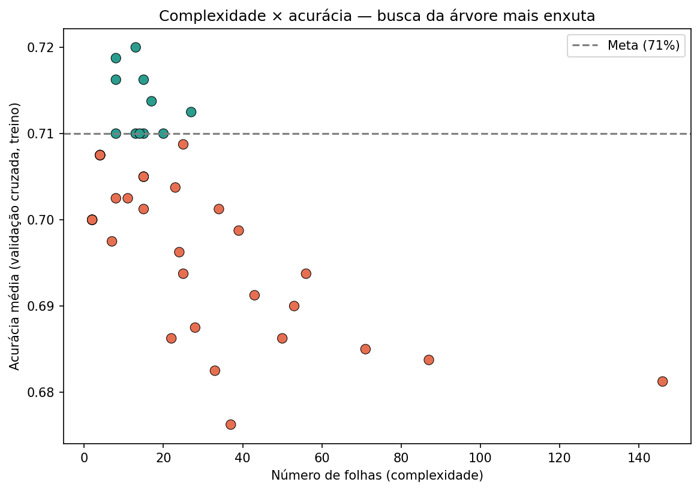

# Simulated Annealing vs. Gradient Boosting

### Um estudo comparativo de estratégias de buscas em inteligência artificial

**Professora:** Polyana Santos Fonseca Nascimento
**Autores:** Gustavo Teixeira Bittencourt de Oliveira, Edgar Klewert, Christophe Abelem, Adler Castro

---

## Sobre o projeto

Este repositório reúne a aplicação prática e a comparação crítica de duas abordagens de Inteligência Artificial vistas ao longo do bimestre: **Busca Local** e **Árvore de Decisão**. Em vez de apenas rodar os algoritmos, o objetivo foi entender por que cada um se comporta como se comporta, justificar as escolhas técnicas com evidência (não com "achismo"), e discutir honestamente os limites de cada resultado.

- Aplicar pelo menos duas modalidades de IA estudadas em disciplina a problemas realistas
- Justificar tecnicamente cada algoritmo e cada decisão de projeto
- Documentar parâmetros, decisões e limitações — inclusive quando o resultado não é o esperado
- Comparar as abordagens sob critérios equivalentes

---

## 1. Busca Local — Hill Climbing, Simulated Annealing e SA com Reaquecimento

**Problema:** EVRP (*Electric Vehicle Routing Problem*) — roteamento de veículos elétricos com restrição de autonomia de bateria e recarga em estações específicas, construído a partir do TSP **GR17** (TSPLIB, Groetschel), um problema clássico de 17 cidades com matriz de distância real e tour ótimo conhecido (custo 2085). O GR17 foi adaptado para EVRP por mapeamento manual de papéis sobre os 17 nós já existentes — depósito (nó 1), estações de recarga (nós 3, 9, 14) e clientes (os demais 13 nós) — sem alterar nenhuma distância da matriz original.

### Algoritmos comparados

| Algoritmo | Tipo | Papel na comparação |
|---|---|---|
| **Hill Climbing** (reinício aleatório) | Busca local gulosa | Algoritmo obrigatório da modalidade — baseline; só aceita vizinhos melhores-ou-iguais, reinicia ao estagnar |
| **Simulated Annealing** | Busca local probabilística, resfriamento geométrico | Algoritmo principal da modalidade — aceita pioras com probabilidade decrescente; `cooling_rate` calibrado analiticamente (não por tentativa e erro) |
| **SA com reaquecimento** | Variante de Simulated Annealing | Variante aprimorada — reaquece a temperatura quando a melhor solução global fica estagnada por um número de iterações |

**Por que essa escolha:** o espaço de busca do EVRP combina a dificuldade combinatória do TSP com uma restrição adicional de viabilidade de bateria, criando um espaço irregular, com múltiplos ótimos locais e regiões inviáveis. O Hill Climbing, por só aceitar vizinhos melhores-ou-iguais, fica preso no primeiro ótimo local ou platô; o Simulated Annealing aceita, com probabilidade decrescente ao longo da execução, movimentos que pioram temporariamente a solução — o que se mostrou necessário neste problema especificamente para escapar da região inviável do espaço de busca. A variante com reaquecimento testa se reabrir essa exploração probabilística depois que a temperatura já esfriou traz algum ganho adicional.

### Dataset

**GR17** (TSPLIB), 17 cidades — matriz de distância real e tour ótimo de referência conhecido. Datasets EVRP prontos foram avaliados e descartados por não se encaixarem no escopo e prazo do módulo: o E-VRPTW de Schneider, Stenger & Goeke (2014) adiciona janelas de tempo (complexidade além do necessário), e o EC-TSP dataset (Gialos & Zeimpekis, 2023, Mendeley) exigiria um trabalho de parsing/limpeza desproporcional. Com autorização da professora para adaptar um dataset existente (desde que documentado), o GR17 foi adotado e mapeado para EVRP: `BATTERY_CAPACITY=800`, `CONSUMPTION_RATE=1.0` (1:1 com a distância), `RECHARGE_MODE="full"` (recarga sempre total ao passar por depósito/estação).

### Metodologia

- Os três algoritmos compartilham a mesma função objetivo (`evaluate = custo de distância + penalidade de viabilidade de bateria`) e os mesmos operadores de vizinhança — condição necessária para que a comparação entre eles seja válida.
- Execuções pareadas: a mesma seed é usada nos três algoritmos em cada rodada, garantindo que todos partam da mesma rota inicial.
- **n=30 execuções**, `total_evaluations=20.000` avaliações por execução para os três algoritmos, `seed_base=2026`.
- Teste de **Wilcoxon pareado** sobre o custo final para os três pares possíveis.

### Resultados (n=30)

| Algoritmo | Taxa de viabilidade | Custo médio | Custo mediano |
|---|---:|---:|---:|
| Hill Climbing (orçamento fixo) | 29/30 | 2750,1 | 2680,0 |
| Simulated Annealing (schedule calibrado) | 30/30 | 2536,3 | 2530,0 |
| SA com reaquecimento (calibrado) | 30/30 | 2596,6 | 2556,0 |

| Teste de Wilcoxon (pareado) | Estatística | p-valor |
|---|---:|---:|
| Hill Climbing vs. Simulated Annealing | 36,5000 | 0,000055 |
| Hill Climbing vs. SA com reaquecimento | 63,0000 | 0,000489 |
| Simulated Annealing vs. SA com reaquecimento | 125,5000 | 0,027741 |

### O que esses números mostram

Dois achados de processo sustentam esses resultados. Primeiro, a **correção da função de penalidade**: a versão original penalizava toda rota inviável com um valor fixo em degrau, sem gradiente entre "quase viável" e "muito inviável" — sob essa penalidade, o Hill Climbing nunca encontrava uma rota viável em mais de 1 milhão de avaliações testadas. Substituí-la por uma penalidade proporcional ao déficit total de bateria destravou a busca: nas mesmas condições, o Hill Climbing passou a encontrar viabilidade em 20 de 20 execuções. Segundo, a **recalibração do resfriamento do SA**: o `cooling_rate` fixo inicial (0,995) esgotava a temperatura em cerca de 8,5% do orçamento de 20.000 avaliações, fazendo o SA se comportar como uma busca gulosa comum pelo resto da execução. Calculando `cooling_rate` analiticamente para consumir o orçamento inteiro, a vantagem real do SA sobre o Hill Climbing apareceu de forma nítida (p=0,000055 acima).

A variante de reaquecimento, porém, **não superou o SA puro** — Simulated Annealing venceu o SA com reaquecimento (p=0,027741), com significância mais modesta que os outros dois pares, mas ainda válida. Reaquecer com os parâmetros exploratórios iniciais chegou a quebrar o algoritmo sob o novo schedule (apenas 1 em 30 execuções viáveis, antes da recalibração); mesmo depois de recalibrado, o reaquecimento recuperou a viabilidade (30/30) mas não trouxe ganho sobre o SA puro — um resultado honesto, não escondido: para este problema pequeno (17 nós) com um schedule já bem calibrado, a busca probabilística padrão parece já dispor de exploração suficiente sem perturbações extras.

Todas as decisões técnicas deste módulo — com as verificações empíricas que as sustentam — estão em [`busca-local/docs/DECISOES.md`](busca-local/docs/DECISOES.md).

---

## 2. Árvore de Decisão — C4.5 vs. Gradient Boosting

**Problema:** concessão de crédito — classificar clientes como bom ou mau pagador a partir de seu histórico e situação financeira. Um problema real do setor financeiro, em que os dois tipos de erro têm custo bem diferente: aprovar crédito a um mau pagador custa mais caro do que recusar crédito a um bom pagador.

### Dataset

**[German Credit / Statlog](https://www.openml.org/search?type=data&id=31)** (`credit-g`, OpenML), com atributos legíveis — saldo em conta, histórico de crédito, duração e valor do empréstimo — e desbalanceamento moderado (70% bons / 30% maus pagadores).

O dataset originalmente cogitado, Credit Card Fraud (Kaggle), foi descartado: seus atributos são anonimizados por PCA (`V1`–`V28`, sem significado interpretável) e apenas ~0,17% das transações são fraude — desbalanceamento tão extremo que uma árvore sem nenhuma divisão já teria mais de 99% de acurácia, tornando qualquer meta de acurácia trivial e qualquer regra impossível de confrontar com conhecimento de domínio.

### Algoritmos comparados

| Algoritmo | Tipo | Biblioteca | Papel na comparação |
|---|---|---|---|
| **C4.5** | Árvore única, com razão de ganho | `chefboost` | Estratégia pedida pelo enunciado — árvore de decisão "clássica" |
| **Gradient Boosting** | Ensemble de árvores rasas treinadas sequencialmente | `scikit-learn` | Estratégia de ensemble, corrige o erro residual da anterior a cada passo |
| **CART (entropia)** | Árvore única | `scikit-learn` | Referência adicional — **não é C4.5** (cortes sempre binários, sem razão de ganho, poda diferente) |

### Metodologia

- Divisão treino/teste estratificada 80/20, com semente fixa para reprodutibilidade.
- Escolha de hiperparâmetros (profundidade, folhas mínimas) por validação cruzada **apenas no treino** — o conjunto de teste só é usado uma vez, no final, para não inflar o resultado.
- Meta de acurácia definida em **71%**, acima das duas baselines medidas (classe majoritária e árvore de um único nível, ambas em 70%) e dentro do teto empírico observado (~72%).
- Entre as configurações que atingem a meta, escolhe-se a **árvore mais enxuta** (menor número de folhas, depois menor profundidade) — o objetivo não é a árvore mais acurada possível, e sim a mais simples que já é "boa o suficiente".

### Resultados

| Modelo | Acurácia (teste) | Profundidade | Folhas / árvores | Regras legíveis? |
|---|---:|---:|---:|---|
| CART enxuto (referência) | 70,5% | 3 | 8 | Sim — poucas regras curtas |
| **C4.5** (chefboost) | 72,0% | 1 | 3 | Sim, mas não atinge a meta na validação |
| **Gradient Boosting** | 76,0% | 3 | 100 árvores | Não — só a importância agregada das variáveis é legível |

### Análise do gráfico: complexidade × acurácia



O gráfico acima mostra as 45 configurações testadas na busca do CART (9 profundidades × 5 valores de folha mínima), com o número de folhas no eixo X, a acurácia média de validação cruzada no eixo Y, e a meta de 71% marcada pela linha tracejada.

- **Árvores rasas demais (2 ou 4 folhas, profundidade 1-2)** ficam pouco acima da baseline de classe majoritária (70%) — entre 70,0% e 70,8% — abaixo da meta em qualquer configuração de folha mínima: perguntas únicas não capturam sinal suficiente neste dataset.
- **As configurações que atingem a meta se concentram entre 8 e 27 folhas** (pontos verdes), formando um platô estreito de acurácia entre 71,0% e 72,0% — não existe uma árvore "muito melhor" nessa faixa, só variações pequenas.
- **Além de ~30 folhas, a acurácia cai e passa a oscilar** conforme a árvore cresce sem limite — chegando a 68,1% na configuração mais complexa (146 folhas, profundidade 22, sem controle de folha mínima). Mais complexidade não compra mais acurácia aqui: compra sobreajuste às dobras de treino.
- **O ponto de maior acurácia da busca inteira** é profundidade 4 / folha mínima 20 (13 folhas, 72,0% de CV) — mas **não foi o escolhido**. Pela regra de desempate (menor número de folhas primeiro), a configuração vencedora é profundidade 3 / folha mínima 1 (8 folhas, 71,9% de CV): a diferença de acurácia entre as duas é desprezível, e a segunda é visivelmente mais enxuta no gráfico (mais à esquerda). É exatamente o comportamento pretendido pelo critério de seleção: entre opções equivalentes em desempenho, vence a mais simples, não a mais acurada.

### O que esses números mostram

O Gradient Boosting vence em acurácia, como esperado de um ensemble — mas ao custo total de interpretabilidade: 100 árvores combinadas não podem ser lidas como um conjunto de regras, só resumidas por importância de variável.

O achado mais interessante, porém, veio do C4.5: apesar de fechar em 72% no teste, a busca por validação cruzada mostrou que sua acurácia **piora conforme a árvore cresce** (70,3% em profundidade 1, caindo até 67,9% em profundidade 5) — e nunca atinge de forma confiável a meta de 71%. A causa identificada: a implementação do C4.5 usada não faz poda real (só limita profundidade), e cada divisão categórica abre um ramo por categoria — com atributos de muitas categorias, isso fragmenta rapidamente o treino em subgrupos pequenos e ruidosos. O CART, com controle de mínimo de amostras por folha e cortes sempre binários, evita esse problema. Essa limitação não foi escondida: é reportada como parte legítima da comparação entre "C4.5 pronto de biblioteca" e "CART com controle fino de hiperparâmetros".

Também vale registrar que acurácia sozinha engana neste problema: a árvore CART mais enxuta, apesar de 70,5% de acurácia geral, acertou apenas 4 de 60 maus pagadores reais no teste — o modelo tende a sempre prever "bom pagador". Como aprovar crédito a quem não vai pagar custa mais caro que o contrário, essa limitação é discutida explicitamente em vez de ser mascarada pela acurácia agregada.

Todas as decisões técnicas deste módulo — com as verificações empíricas que as sustentam — estão em [`arvore-decisao/docs/DECISOES.md`](arvore-decisao/docs/DECISOES.md).

---

## Estrutura do repositório

```
.
├── busca-local/
│   ├── data/raw/                   # dataset GR17 (TSPLIB) original
│   ├── src/busca_local/            # EVRP, Hill Climbing, Simulated Annealing, SA com reaquecimento
│   ├── notebooks/                  # notebook principal — a entrega desta modalidade
│   ├── tests/                      # testes automatizados (pytest, 37 testes)
│   ├── docs/                       # DECISOES.md e RESUMO_ESTRUTURA.md
│   └── resultados/                 # CSVs dos experimentos oficiais (HC, SA, SA-reaquecido)
├── arvore-decisao/
│   ├── data/                       # cache do dataset German Credit (OpenML)
│   ├── src/arvore/                 # métricas de divisão, C4.5, CART, ensemble, avaliação
│   ├── notebooks/                  # notebook principal — a entrega desta modalidade
│   ├── tests/                      # testes automatizados (pytest)
│   ├── docs/                       # DECISOES.md e GUIA_ARGUICAO.md
│   └── resultados/                 # figuras e tabelas geradas
└── docs/                           # relatório final e análise comparativa
```

## Como reproduzir

```bash
cd busca-local
python3 -m venv .venv && source .venv/bin/activate
pip install -r requirements.txt

pytest tests/                       # 37 testes automatizados
jupyter notebook notebooks/simulated_annealing_evrp.ipynb   # notebook principal
```

```bash
cd arvore-decisao
python3 -m venv .venv && source .venv/bin/activate
pip install -r requirements.txt

pytest tests/                       # 23 testes automatizados
jupyter notebook notebooks/arvore_decisao.ipynb   # notebook principal (roda também no Google Colab)
```

## Tecnologias

- Python 3.x
- scikit-learn (CART, Gradient Boosting)
- chefboost (C4.5)
- NumPy / Pandas
- SciPy (testes estatísticos — Wilcoxon)
- Matplotlib (visualização de resultados)
- Jupyter / nbconvert (notebooks)
- pytest (testes automatizados)

